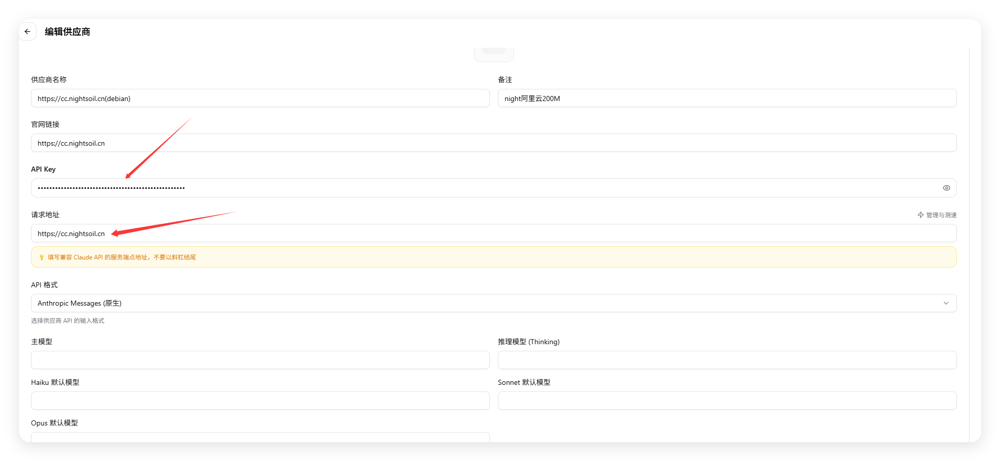
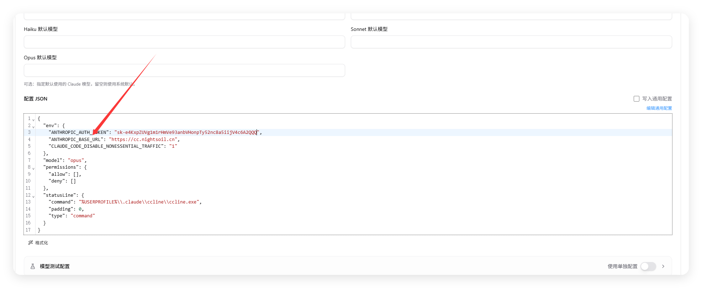
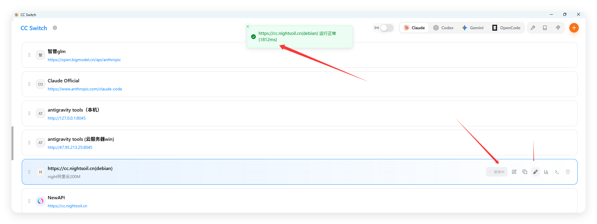

# Claude Code 配置

1. 打开你下载的CC Switch软件，你会看到如下图的初始界面

   根据图片提示把请求地址和api key写好

   https://cc.nightsoil.cn  

   sk-e4KxpZUVg1m1rHmVe93anbVHonpTy52nc8a5iijV4c6A2QQQ

{
  "env": {
    "ANTHROPIC_AUTH_TOKEN": "sk-e4KxpZUVg1m1rHmVe93anbVHonpTy52nc8a5iijV4c6A2QQQ",
    "ANTHROPIC_BASE_URL": "https://cc.nightsoil.cn",
    "CLAUDE_CODE_DISABLE_NONESSENTIAL_TRAFFIC": "1"
  },
  "model": "opus",
  "permissions": {
    "allow": [],
    "deny": []
  },
  "statusLine": {
    "command": "%USERPROFILE%\\.claude\\ccline\\ccline.exe",
    "padding": 0,
    "type": "command"
  }
}

然后改成启用，点击测速返回 运行正常即可

2.点击左上角“设置”按钮，在通用页面下拉找到 `跳过 Claude Code初次安装确认` ，务必勾选

3.在终端运行 `claude`，看到对话界面并能正常回复即表示配置完成

