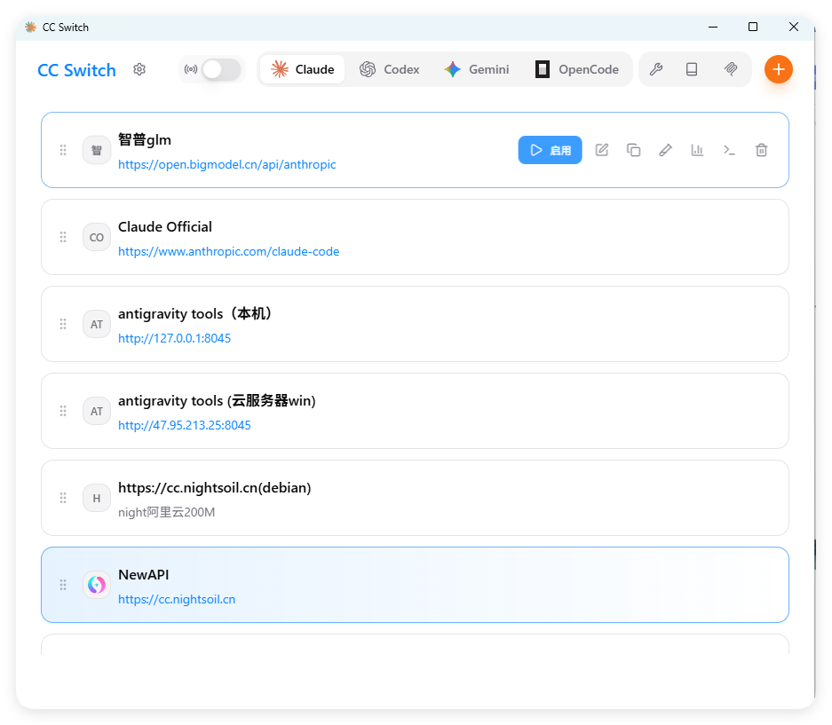
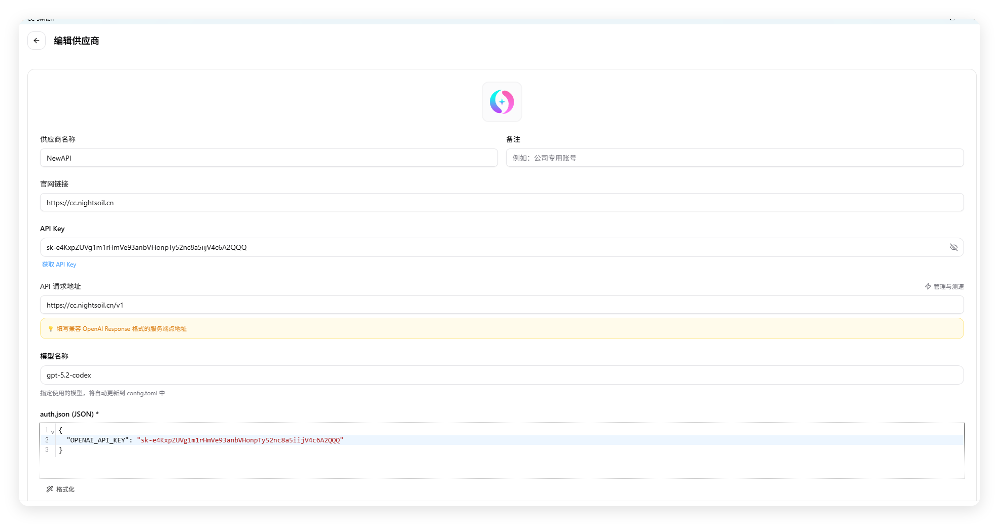
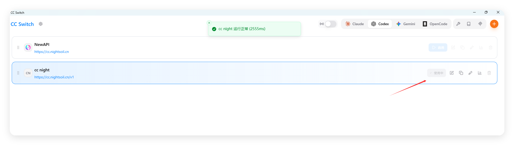
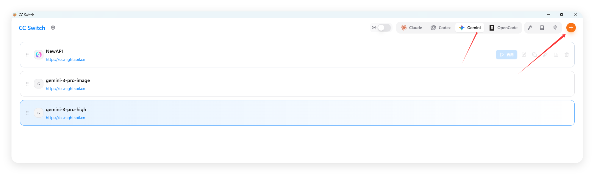
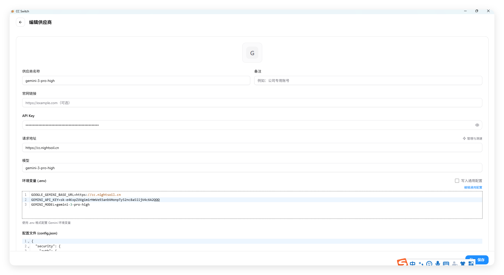
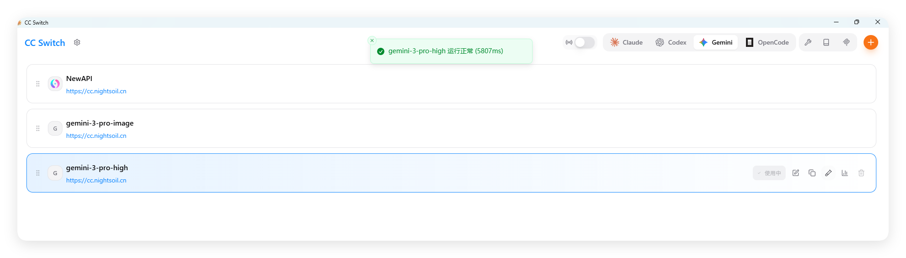
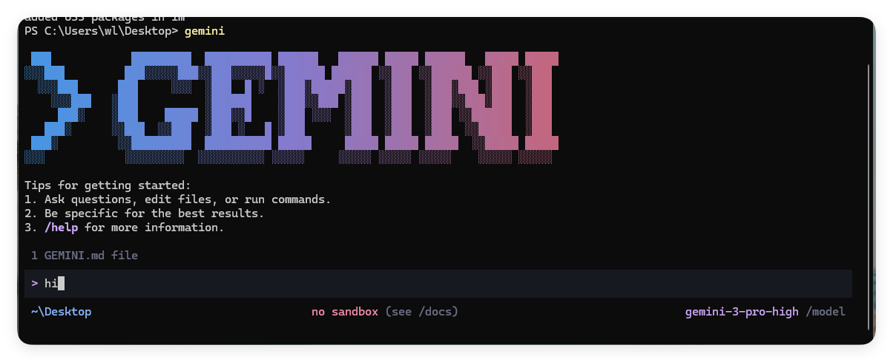

# 通用配置

### [CC-Switch介绍](https://docs.packyapi.com/docs/ccswitch/#cc-switch介绍)

### Claude Code / Codex / Gemini CLI 全方位辅助工具

[](https://github.com/farion1231/cc-switch/releases)
[](https://github.com/trending/typescript)
[](https://github.com/farion1231/cc-switch/releases)
[](https://tauri.app/)
[](https://github.com/farion1231/cc-switch/releases/latest)

[](https://trendshift.io/repositories/15372)

[更新日志](https://github.com/farion1231/cc-switch/blob/main/CHANGELOG.md) | [下载地址](https://github.com/farion1231/cc-switch/releases/latest)

**从供应商切换器到 AI CLI 一体化管理平台**

**统一管理 Claude Code、Codex 与 Gemini CLI 的供应商配置、MCP 服务器、Skills 扩展和系统提示词。**

使用 CC-Switch，您可以：

- ✅ 一键切换 API 配置 - 在多个 API 提供商之间快速切换
- ✅ 可视化配置管理 - 通过图形界面轻松管理所有配置
- ✅ MCP 服务器管理 - 管理 Model Context Protocol 服务器
- ✅ 系统托盘快捷操作 - 通过托盘菜单快速切换

### [软件下载](https://docs.packyapi.com/docs/ccswitch/#软件下载)

WindowsMacOSLinux

1. 点击下载链接→[传送门](https://github.com/farion1231/cc-switch/releases/latest)←，进入CC-Switch的Github Release页面
2. 鼠标滚动到最下方选择适合自己版本的安装包，windows系统推荐下载普通msi后缀的安装包进行安装

3. 安装后运行CC-Switch主程序，界面如下。



注意

**请你最好进行此步的环境检查步骤！！！
如果你有经验，能确认你的Nodejs环境以及cc、codex、gemini的cli安装没问题，配置目录也都存在，可以忽略这一步，直接进入以下的CC Switch配置**

点击右侧传送门查看 [如何进行环境检查？]()

## [ Claude Code配置]

```
# Claude Code (Native install - recommended)
curl -fsSL https://claude.ai/install.sh | bash
```

1. 打开你下载的CC Switch软件，你会看到如下图的初始界面

   根据图片提示把请求地址和api key写好

   https://cc.nightsoil.cn  

   sk-e4KxpZUVg1m1rHmVe93anbVHonpTy52nc8a5iijV4c6A2QQQ


{
  "env": {
    "ANTHROPIC_AUTH_TOKEN": "sk-e4KxpZUVg1m1rHmVe93anbVHonpTy52nc8a5iijV4c6A2QQQ",
    "ANTHROPIC_BASE_URL": "https://cc.nightsoil.cn",
    "CLAUDE_CODE_DISABLE_NONESSENTIAL_TRAFFIC": "1"
  },
  "model": "opus",
  "permissions": {
    "allow": [],
    "deny": []
  },
  "statusLine": {
    "command": "%USERPROFILE%\\.claude\\ccline\\ccline.exe",
    "padding": 0,
    "type": "command"
  }
}

然后改成启用，点击测速返回 运行正常即可


2.点击左上角“设置”按钮，在通用页面下拉找到 `跳过 Claude Code初次安装确认` ，务必勾选


3.在终端运行 `claude`，看到对话界面并能正常回复即表示配置完成


## [ Codex配置]

npm i -g @openai/[codex@v0.91.0](mailto:codex@v0.91.0)

1. 打开你下载的CC Switch软件，你会看到如下图的初始界面


2.填写api地址和api key

api key :sk-e4KxpZUVg1m1rHmVe93anbVHonpTy52nc8a5iijV4c6A2QQQ

api 请求地址：https://cc.nightsoil.cn/v1



3.添加成功后，在主界面会看到我们配置的分组，在右侧点击“启用”按钮，显示“使用中”，则配置完成



4.在终端运行 `codex`，看到对话界面并能正常回复即表示配置完成


## [ Gemini配置]

​    安装：npm i -g @google/gemini-cli@latest

1. 打开你下载的CC Switch软件，你会看到如下图的初始界面

2.下拉模态框，找到“API Key”配置项，填入你刚才复制的ApiKey，再点击右下角“添加”按钮

GOOGLE_GEMINI_BASE_URL=https://cc.nightsoil.cn
GEMINI_API_KEY=sk-e4KxpZUVg1m1rHmVe93anbVHonpTy52nc8a5iijV4c6A2QQQ
GEMINI_MODEL=gemini-3-pro-high



3.添加成功后，在主界面会看到我们配置的分组，在右侧点击“启用”按钮，显示“使用中”，则配置完成




4.在终端运行 `gemini`，看到对话界面并能正常回复即表示配置完成

