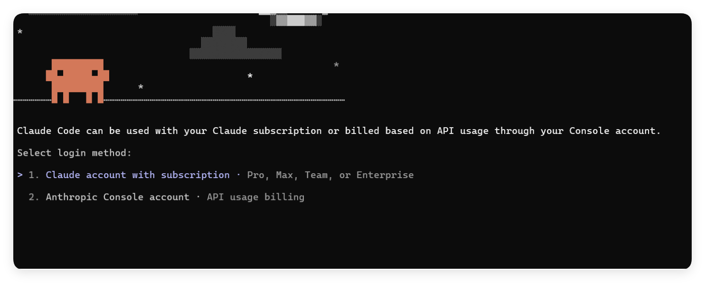

# Claude Code 常见问题

### [claude code 无法连接到 Anthropic 服务]

**如果你是首次配置根据链接跳转到这一步，直接按照下面的教程运行命令即可**

使用npm安装完claude之后。
在命令行输入claude报了如下错误：


```text
Unable to connect to Anthropic services
Failed to connect to api.anthropic.com: ERR BAD REQUEST
lease check your internet connection and network settings.
Note: Claude Code might not be available in your country, Check supported countries atnttps://anthropic.com/supported-countriesS E:ltoollclaude code>
```


或是在你初次配置时出现以下问题：



WindowsMacOS

1. 按下键盘 `Win + R` 键，输入 `cmd` 后回车，打开命令行程序
2. 在命令行中运行以下命令后回车


```bash
powershell -Command "$f='%USERPROFILE%\.claude.json';$j=Get-Content $f|ConvertFrom-Json;$j|Add-Member -NotePropertyName 'hasCompletedOnboarding' -NotePropertyValue $true -Force;$j|ConvertTo-Json|Set-Content $f"
```

或者：

找到配置文件：`C:\Users\你的用户名\.claude.json`

把里面的 `hasCompletedOnboarding` 改成 `true` 即可：

```json
{
  "hasCompletedOnboarding": true
}
```

重启你的Claude Cli